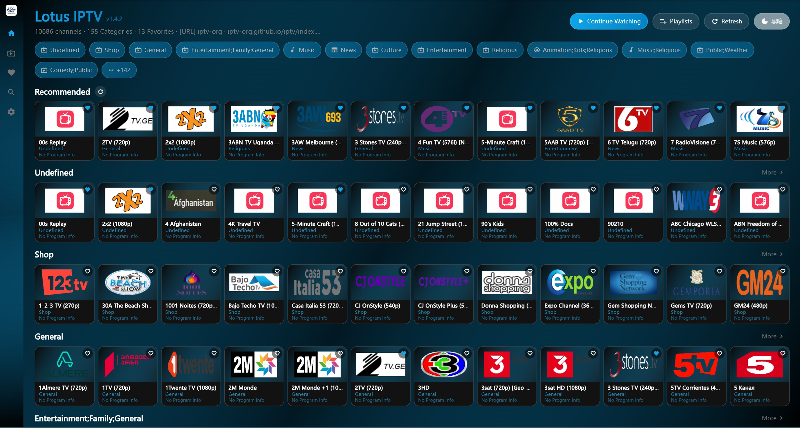
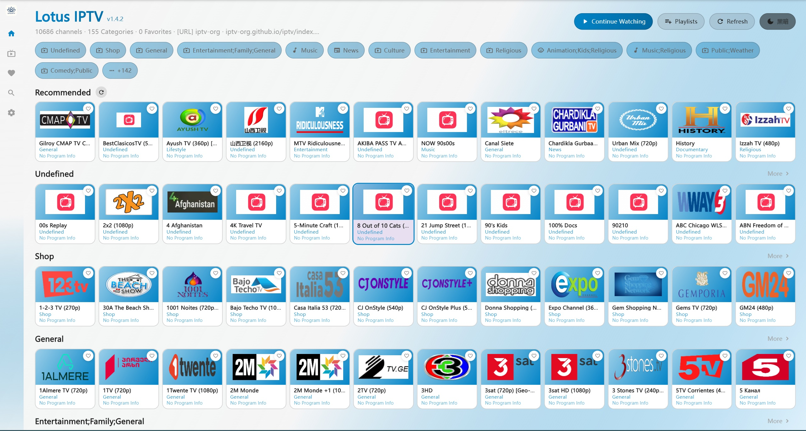
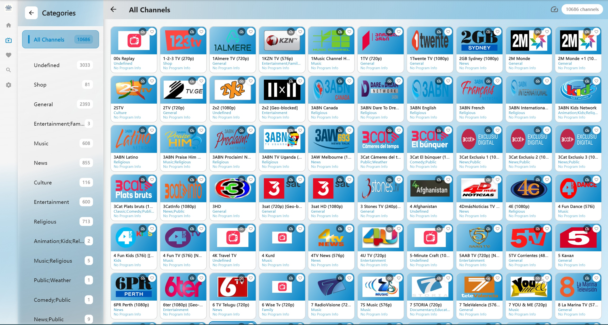
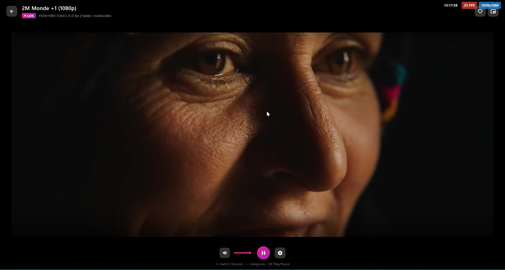
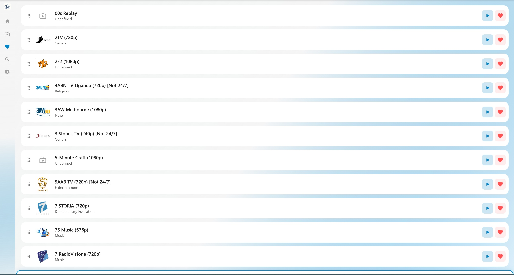
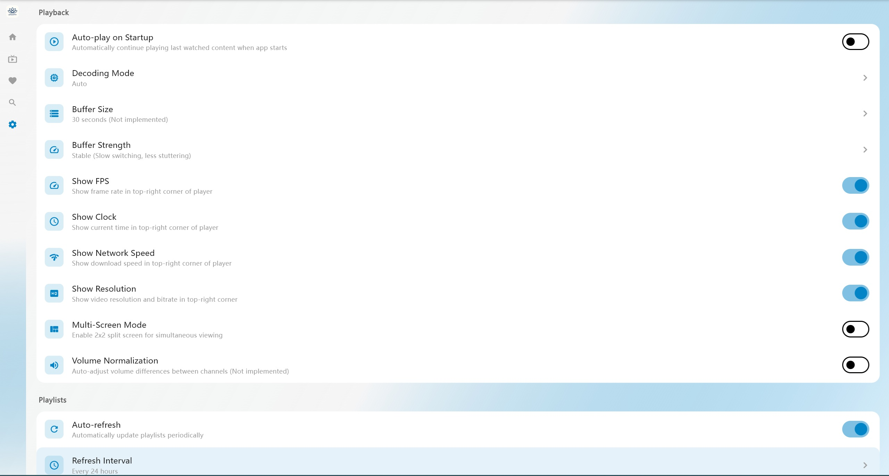
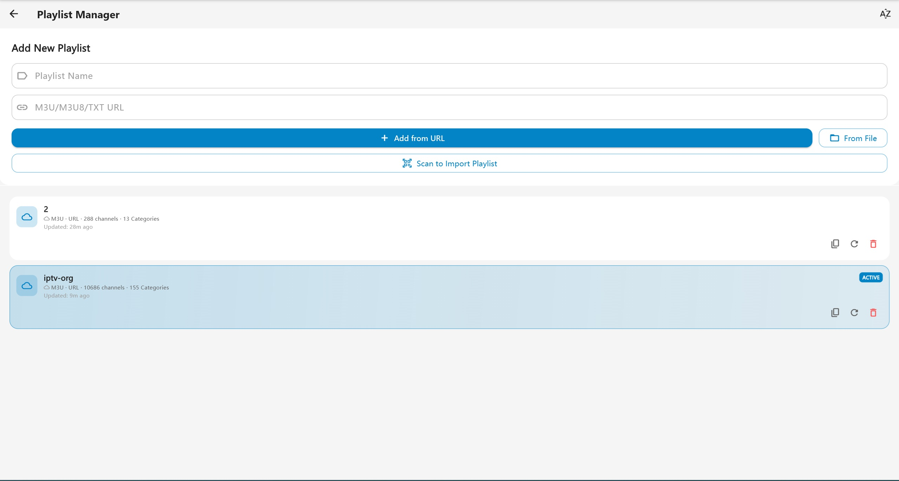
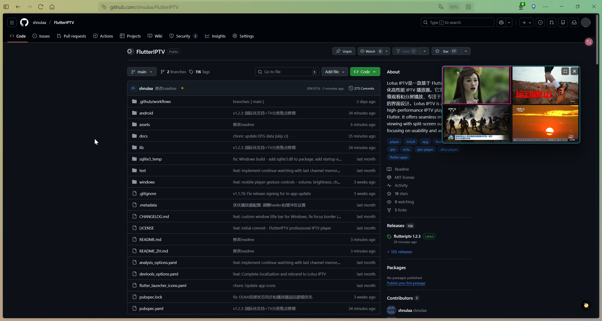
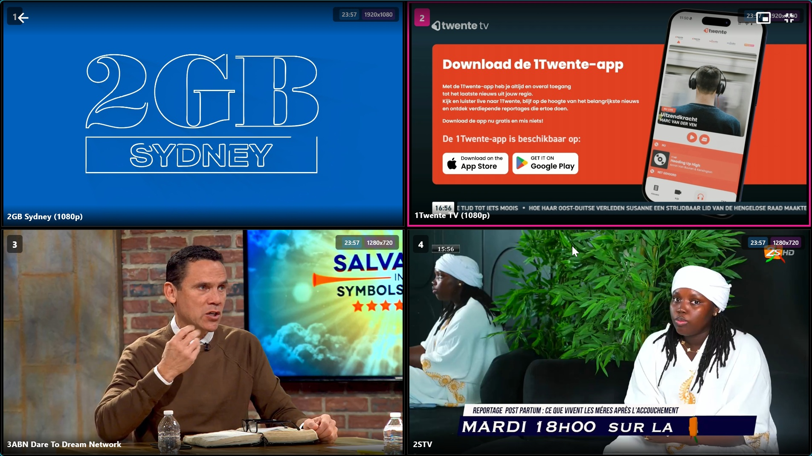

# Visi.News IPTV

<p align="center">
  
</p>

<p align="center">
  <strong>A Modern IPTV Player for Windows, Android, and Android TV</strong>
</p>
Visi.News IPTV is a modern, high-performance IPTV player built with Flutter. Features a beautiful VisiNews-themed UI with gradient accents(Split-screen support), optimized for seamless viewing across desktop, mobile, and TV platforms.

## 📸 Screenshots

<table>
  <tr>
    <td align="center"><br><sub>🏠 Home Dark Theme</sub></td>
    <td align="center"><br><sub>🏠 Home Light Theme</sub></td>
    <td align="center"><br><sub>📡 Channels</sub></td>
  </tr>
  <tr>
    <td align="center"><br><sub>▶️ Player</sub></td>
    <td align="center"><br><sub>❤️ Favorites</sub></td>
    <td align="center"><br><sub>⚙️ Settings</sub></td>
  </tr>
  <tr>
    <td align="center"><br><sub>📂 Playlist Manager</sub></td>
    <td align="center"><br><sub>📺 Split Mini Screen</sub></td>
    <td align="center"><br><sub>📺 Split Screen</sub></td>    
  </tr>
</table>


## 🚀 Getting Started

### 📋 Adding IPTV Playlists

To start watching channels, you need to add M3U/M3U8/TXT playlist sources:

#### 🌍 Free Public Playlists
For testing and demonstration purposes, you can use this free public playlist:
```
https://iptv-org.github.io/iptv/index.m3u
```

**How to add:**
1. Open Visi.News IPTV
2. Click "Add Playlist" or "+" button
3. Select "From URL"
4. Paste the URL above
5. Click "Add" and wait for channels to load

#### 📁 Other Playlist Sources
- **Local Files**: Import `.m3u` or `.m3u8` files from your device
- **Custom URLs**: Add your own IPTV service URLs
- **QR Code**: Scan QR codes containing playlist URLs

> **Note**: The public playlist above contains channels from various countries and may have varying availability. For the best experience, use playlists from your IPTV service provider.

## 🚀 Download

Download the latest version from Google Playstore.

**Supported Platforms**

- **Android Mobile**: APK for arm64-v8a, armeabi-v7a, x86_64
- **Android TV**: APK for arm64-v8a, armeabi-v7a, x86_64

## 🎮 Controls

### Desktop/Mobile

| Action | Keyboard | Mouse/Touch |
|--------|----------|-------------|
| Play/Pause | Space/Enter | Click |
| Channel Up | ↑ | Swipe Up |
| Channel Down | ↓ | Swipe Down |
| Open Category Panel | ← | - |
| Switch Source | ←/→ | - |
| Favorite | F | Long Press |
| Mute | M | - |
| Exit Player | Double Esc | - |
| Enter Multi-Screen | - | Click Button |

### Android TV

| Action | Remote Button | Description |
|--------|---------------|-------------|
| Play/Pause | OK (short press) | Toggle playback |
| Channel Up/Down | D-Pad Up/Down | Switch channels |
| Open Category Panel | D-Pad Left (long press) | Show category list |
| Switch Source | D-Pad Left/Right | Switch between sources |
| Favorite | OK (double click) | Add/remove favorite |
| Enter Multi-Screen | OK (long press) | Enter 2x2 split screen mode |
| Exit Player | Back (double press) | Return to channel list |

### TV Multi-Screen Mode

| Action | Remote Button | Description |
|--------|---------------|-------------|
| Move Focus | D-Pad | Move between 4 screens (also switches audio) |
| Select Channel | OK (short press) | Open channel selector for focused screen |
| Clear Screen | OK (long press) | Clear channel from focused screen |
| Exit Multi-Screen | Back | Return to single player (if channel playing) or exit |


## ✨ Features

### 🎨 Multi-Color Theme System
- **12 Preset Color Schemes**: 6 dark themes + 6 light themes
- **Dynamic Theme Switching**: Change colors across entire UI instantly
- **Color Schemes**: Lotus Pink, Ocean Blue, Forest Green, Sunset Orange, Royal Purple, Cherry Red
- Glassmorphism style cards for desktop/mobile
- TV-optimized interface with smooth performance
- Auto-collapsing sidebar navigation
- Theme colors applied globally: selection boxes, buttons, icons, gradients

### 📺 Multi-Platform Support
- **Android Mobile**: Touch-friendly interface with gesture controls
- **Android TV**: Full D-Pad navigation with remote control support

### ⚡ High-Performance Playback
- **Desktop/Mobile**: Powered by `media_kit` with hardware acceleration
- **Android TV**: Native ExoPlayer (Media3) for 4K video playback
- Real-time FPS display (configurable in settings)
- Video stats display (resolution, codec info)
- Supports HLS (m3u8), MP4, MKV, RTMP/RTSP and more

### 📂 Smart Playlist Management
- Import M3U/M3U8/TXT playlists from local files or URLs
- QR code import for easy mobile-to-TV transfer
- Auto-grouping by `group-title`
- Preserves original M3U category order
- Channel availability testing with batch operations

#### Supported Playlist Formats
- **M3U/M3U8**: Standard IPTV playlist format with EPG and logo support
- **TXT**: Simplified text format using `,#genre#` as category marker
  ```
  Category Name,#genre#
  Channel Name,Channel URL
  Channel Name,Channel URL
  ```

### ❤️ User Features
- Favorites management with long-press support
- Channel search by name or group
- In-player category panel (press LEFT key)
- Double-press BACK to exit player (prevents accidental exit)
- Watch history tracking
- **Auto Channel Logo Matching**: 1088+ pre-embedded channel logos with smart fuzzy matching
  - Automatic logo display for TXT playlists (no logo info)
  - Three-level priority: M3U logo → Database logo → Default image
- **Auto-play on Startup**: Optional continue playback after app launch (disabled by default)
- **Multi-source support**: Auto-merge channels with same name, switch sources with LEFT/RIGHT keys
- **Multi-screen mode** (Desktop & TV): 2x2 split screen for simultaneous viewing of 4 channels, with independent EPG display and mini mode support (Desktop)

### 📡 EPG (Electronic Program Guide)
- Support for XMLTV format EPG data
- Auto-load EPG from M3U `x-tvg-url` attribute
- Manual EPG URL configuration in settings
- Display current and upcoming programs in player
- Program remaining time indicator

### 📺 DLNA Screen Casting
- Built-in DLNA renderer (DMR) service
- Cast videos from other devices to Lotus IPTV
- Support for common video formats
- Playback control from casting device (play/pause/seek/volume)
- Auto-start DLNA service option

## ⚠️ Disclaimer

This application is a player only and does not provide any content. Users must provide their own M3U playlists. Developers are not responsible for the content played through this application.
